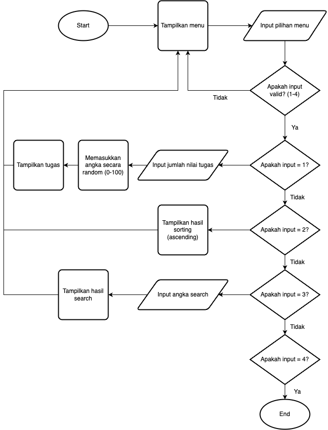
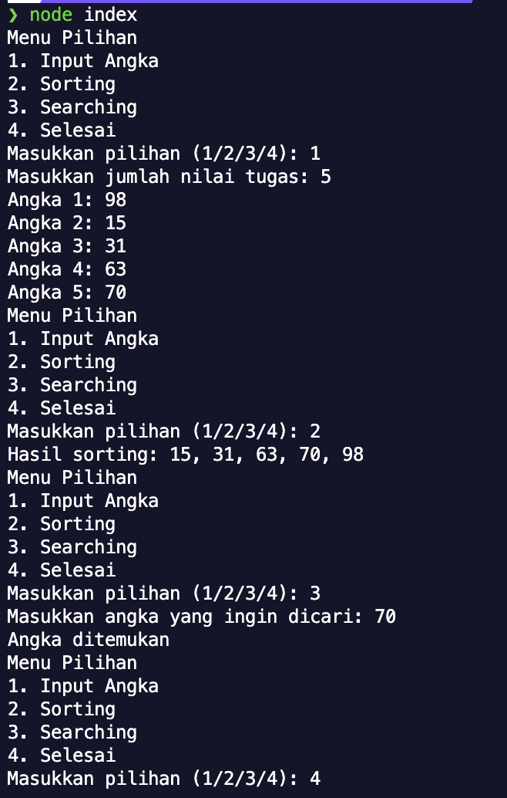

# 1. Menjelaskan varian dan invarian

1. Jelaskan tipe data yang sesuai kaidah pemrograman.
   > Tipe data pada dibagi menjadi 2, yaitu:
   >
   > - Primitive (string, boolean, number, null, dan lain lain)
   > - Non-primitive (array, object, function)
2. Jelaskan variabel data yang sesuai kaidah pemrograman.
   > Variabel adalah keyword yang digunakan untuk mendeklarasikan variabel yang bisa di-reassign(diubah)
3. Jelaskan konstanta yang sesuai kaidah pemrograman.
   > Konstanta adalah keyword yang digunakan untuk mendeklarasikan variabel yang bisa tidak bisa di-reassign(tidak bisa diubah)

# 2. Membuat alur logika (flowchart)

# 3. Menerapkan teknik dasar algoritma umum

1. Membuat algoritma untuk sorting
   > Algoritma yang digunakan adalah Bubble Sort. Bubble Sort bekerja dengan cara melakukan perbadingan terhadap elemen-elemen yang berdekatan secara terus menerus sampai semua elemen sudah ter-urut(ascending/descending)
2. Membuat algoritma untuk searching
   > Algoritma yang digunakan adalah Sequential Search. Sequential Search bekerja dengan cara melakukan perbandingan antara elemen yang dicari dan setiap elemen yang ada pada array.

# 4. Menggunakan prosedur dan fungsi

1. Identifikasi konsep penggunaan kembali prosedur dan fungsi.
   > Prosedur adalah kumpulan kode yang dieksekusi secara bersamaan yang bertujuan untuk menyelesaikan tugas tertentu. Fungsi memiliki definisi yang hampir sama dengan prosedur, namun fungsi harus mengembalikan nilai setelah selesai dieksekusi. Sehingga ketika dieksekusi, fungsi harus dimasukkan kedalam sebuah variabel/konstanta.

Output Program:

# 5. Mengidentifikasikan kompleksitas algoritma

1. Identifikasi kompleksitas waktu algoritma.
   > Bubble Sort: Menggunakan notasi big O algoritma ini memiliki kompleksitas waktu sebesar O(n^2) karena memiliki 2 for-loop/iterasi
   > Sequential Search: Menggunakan notasi big O algoritma ini memiliki kompleksitas waktu sebesar O(n) karena memiliki 1 for-loop/iterasi
2. Identifikasi kompleksitas penggunaan memory algoritma.
   > Bubble Sort: Algoritma ini memiliki kompleksitas memory sebesar O(n) karena bergantung kepada ukuran array yang akan diinput (ukuran jumlah nilai tugas)
   > Sequential Search: Algoritma ini memiliki kompleksitas memory sebesar O(n) karena bergantung kepada ukuran array yang akan diinput (ukuran jumlah nilai tugas)
